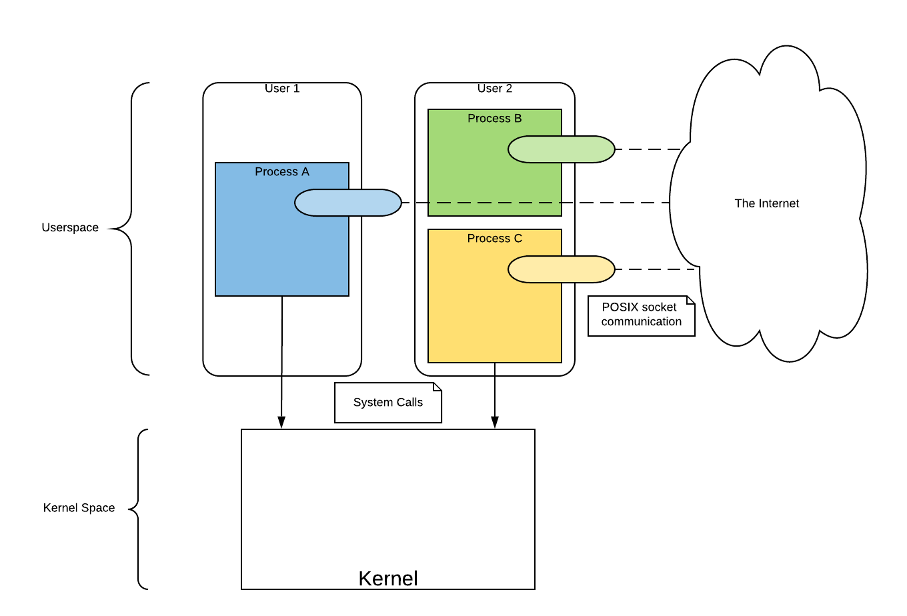
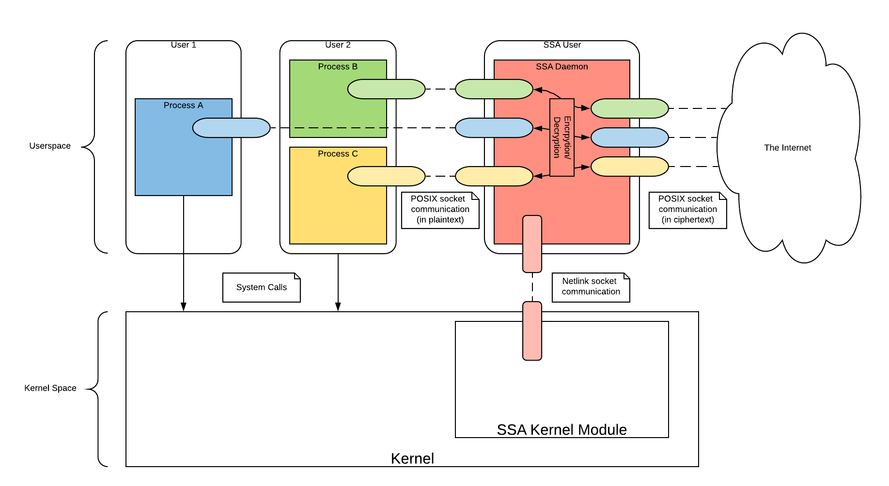

# Developer Documentation

## Purpose 
The developer documentation is for developers who want to contribute to the SSA (if you are a developer hoping to utilize the SSA in your application, see docs/user-documentation.md). It is intended to help developers understand the SSA codebase and to explain how to make changes to the SSA and where those changes should happen. 

It may be helpful for developers to familiarize themselves with the documentation found in `install-documentaion.md`, `user-documentation.md` and `admin-documentation.md` (all found in the `docs` directory).

This document contains information relevant to the SSA as a whole. For information specific to the daemon or the kernel module, see `daemon.md` and `module.md` in this same directory.

## Table of Contents

<!-- START doctoc generated TOC please keep comment here to allow auto update -->
<!-- DON'T EDIT THIS SECTION, INSTEAD RE-RUN doctoc TO UPDATE -->


- [Prerequisites](#prerequisites)
- [Overview](#overview)
- [What happens on startup](#what-happens-on-startup)
  - [Kernel module](#kernel-module)
  - [Daemon](#daemon)
- [Understanding the flow of control](#understanding-the-flow-of-control)
  - [Part A: Creating a socket](#part-a-creating-a-socket)
    - [Sequence diagram](#sequence-diagram)
  - [Part B: Setting the hostname](#part-b-setting-the-hostname)
  - [Part C: Connecting to the endhost](#part-c-connecting-to-the-endhost)
  - [Part D: Sending and Receiving Data](#part-d-sending-and-receiving-data)
  - [Part E: Closing the socket](#part-e-closing-the-socket)

<!-- END doctoc generated TOC please keep comment here to allow auto update -->

## Prerequisites
This documentation assumes you understand the POSIX socket API, meaning you can create simple network clients and servers using calls to `socket`, `bind`, `connect`, etc. It also assumes you are familiar with event-based concurrency. It does _not_ assume that you have any experience in kernel development. Because many contributors to the project are university students, this documentation aims to be accessible to college-level programmers.

## Overview

The following diagram shows non-TLS network communication using POSIX sockets. Processes (through their sockets) communicate directly with other machines over the internet. Sockets are established by making system calls to the kernel (technically, socket communication also involves the kernel, but those details are ommitted from the diagram for simplicity). It is important to note that this diagram also acurately shows TLS network communication using SSA _from the perspective of the application developer._ With SSA, from the point of view of the developer, the only difference between TLS and non-TLS sockets is that TLS sockets transmit encrypted traffic according to the TLS protocol



The next diagram shows the inner-workings of TLS network communication using SSA. Processes create sockets by making system calls to the kernel. When the kernel sees that a process has requested a TLS socket, it defers behavior to the SSA Kernel Module. 

Instead of setting up a socket with the intended end host, the kernel module instead sets up a socket with the SSA daemon process. Then, via a netlink socket, the kernel module instructs the SSA daemon to establish a socket with the process and a corresponding socket with the end host. When setting up the socket with the end host, the daemon performs the TLS handshake with the end host (according to the admin-defined config file) to establish a TLS connection.

When the process sends data through the socket, that data first goes to the SSA daemon, which encrpyts it and then passes it on to the end host. When the end host sends data to the process, that data first goes to the SSA daemon, which decrypts it and then passes it on to the prcoess. The process, however, is unaware that it is communicating through the SSA daemon. It believes that it's socket is connected directly to the end host. 



## What happens on startup

### Kernel module
The kernel module defines socket behavior for a new networking protocol, called `IPPROTO_TLS`. When the kernel module gets loaded, `set_tls_prot_inet_stream` (defined in `tls_inet.c`) gets called. This function (among other things), defines behavior for calls to `socket`, `bind`, `connect`, `listen`, `accept`, `setsockopt` and `getsockopt` (it does this by setting the `proto_ops` and `proto` structures for `IPPROTO_TLS`; more information about this and kernel programming in general can be found [here](https://linux-kernel-labs.github.io/master/labs/networking.html)).

### Daemon
The daemon process is built around an event-loop managed by the [Libevent](https://libevent.org/) library. Libevent monitors sockets for events using bufferevents. Each socket is associated with a `bufferevent` struct, which itself contains pointers to various call-back functions to be invoked in resoponse to detected events. All bufferevents are registered with the event base, which is analogous to an epoll instance. When the daemon is started, the `run_daemon` function (defined in `daemon.c`) is called. This function creates some initial sockets, instantiates the event base, registers those initial sockets with the event base, and runs the event loop (`event_base_dispatch`). The initial sockets include `server_sock`, a socket that listens for incoming connections, and `netlink_sock`, a socket that is used to communicate with the kernel module.

## Understanding the flow of control
Because the SSA is composed of two interacting, event-based programs, it can be difficult to understand how everything works together or to see the logical flow of control through the system. The following is provided to help you understand how the various parts of the SSA work together.

Consider a simple example involving a client running on an SSA-compatible machine, communicating with a server on a remote host. Suppose this client makes the following series of calls, and no errors or interruptions occur:

```
sock_fd = socket(PF_INET, SOCK_STREAM, IPPROTO_TLS);
setsockopt(sock_fd, IPPROTO_TLS, TLS_REMOTE_HOSTNAME, hostname, strlen(hostname)+1)
connect(sock_fd, &addr, sizeof(addr));
send(sock_fd, buf, sizeof(buf)-1, 0);
recv(sock_fd, buf2, sizeof(buf2)-1, 0);
close(sock_fd);
```

The following explanation walks through what happens in the SSA as each of these calls are made. This explanation is intended to help you get a sense of how the SSA works, and is not meant to be comprehensive. That being the case, many details are glossed over, and only a single use case of the SSA is considered (the SSA can also work with non-blocking sockets and with server processes). 

### Part A: Creating a socket

1. The client call to `socket` is intercepted by the kernel module, which calls its own implementation (`tls_inet_init_sock`). This function creates a regular (non-TLS) socket (using `ref_tcp_prot.init`), notifies the daemon (`send_socket_notification`), and waits for a response from the daemon (waiting is done with the completion library declared in `linux/completion.h`).

	 
	
	_At this point, a socket has been allocated in the kernel for the client, but the client does not have a file descriptor for it, as its call to `socket` has not yet returned._

2. When the daemon receives the notification, it creates a regular socket (`socket_cb`), configures OpenSSL to secure default settings (`client_SSL_new`), and notifies the kernel (`netlink_notify_kernel`).

	

3. When the kernel module receives the notification, it calls `report_return`, which causes the `tls_inet_init_sock` function to stop waiting. `tls_inet_init_sock` then finishes by returning the file descriptor of the socket it has created to the client.

	_

#### Sequence diagram

 

_Blue numbered circles reference explanations above_

### Part B: Setting the hostname

4. The client call to `setsockopt` is intercepted by the kernel module, which calls `tls_inet_setsockopt`, which in turn calls `tls_common_setsockopt`. This function saves the hostname passed in by the client (`set_remote_hostname`), notifies the daemon (`send_setsockopt_notification`), and waits for a response from the daemon. 

5. When the daemon receives the notification, it calls `setsockopt_cb`, which sets the hostname in its OpenSSL configuration (`set_remote_hostname`) and notifies the kernel (`netlink_notify_kernel`). (Note: setting the hostname is required because a hostname is needed in the TLS handshake, which will happen during the call to `connect`).

6. When the kernel module receives the notification, it calls `report_return`, which causes the `tls_inet_setsockopt` function to stop waiting. `tls_inet_setsockopt` then returns.


### Part C: Connecting to the endhost

7. The client call to `connect` is intercepted by the kernel module, which calls `tls_inet_connect`. This function binds the source port (if it hasn't been bound already), notifies the daemon (`send_connect_notification`), and waits for a response from the daemon.
	
8. When the daemon receives the notification, it calls `connect_cb`, which configures OpenSSL to use the hostname passed in for validation and creates 2 bufferevents (`client_connection_setup`). The first bufferevent (`plain.bev`, created with `bufferevent_socket_new`) is for monitoring the client-facing socket (which as of yet does not exist; the daemon waits to create it until the client's socket connects to it). The second bufferevent (`secure.bev`, created with `bufferevent_openssl_socket_new`) is for monitoring the internet-facing socket. This is an Openssl bufferevent, which means Libevent will perform the TLS handshake and encryption according to the TLS configurations passed to it. The socket created by the daemon in `socket_cb` is registered with `secure.bev`. 

	
	
9. Finally, the `connect_cb` function calls `bufferevent_socket_connect` to asynchronously connect the internet-facing socket with the destination address and perform the TLS handshake. `connect_cb` then returns. Once the daemon's internet-facing socket successfully connects to the destination server, an event is detected on its bufferevent (`secure.bev`), causing `client_bev_event_cb` to be called. This function notifies the kernel that the connection is established (`netlink_handshake_notify_kernel`).

	

	_A secure (i.e. encrypted) connection is now established between the daemon's socket and the remote server. However, there is currently no connection between the client and the daemon._
	
10. When the module receives the notification, it calls `report_handshake_finished`, which causes the `tls_inet_connect` function to stop waiting. `tls_inet_connect` then calls `ref_inet_stream_ops.connect` to connect the client's socket to the daemon.
	
11. The daemon's listening socket then accepts the connection from the client and creates a socket for that connection. Back in the module, once the connection is established, `ref_inet_stream_ops.connect` returns, after which `tls_inet_connect` returns, causing the client's call to `connect` to return. 

	

	_The client's socket is now connected to the daemon's client-facing socket_

12. Meanwhile, in the daemon, the incoming connection triggers a call to the callback function registered with the listening socket's bufferevent (`accept_cb`). `accept_cb` associates the newly created socket with the `plain.bev` bufferevent created in `connect_cb` (`associate_fd`).

	

	_A plain-text connection is now established between the client and the daemon, which is in turn securely connected to the remote server. It is important to note, however, that from the client's perspective, it is now securely connected directly to the remote server._

### Part D: Sending and Receiving Data	

13. The client call to `send` causes data to be sent from the client's socket to the daemon's client-facing socket, triggering a read event on `plain.bev`. This causes a call to `tls_bev_read_cb`, which transfers the data to the out-buffer of the internet-facing socket. That data is then encrypted and sent by Libevent. 

14. When a response is received from the destination server, Libevent decrypts it and places it in `secure.bev`'s input buffer, triggering a read event. This causes a call to `common_bev_read_cb`, which transfers the data to the out-buffer of the client-facing socket. That data is then sent to the client by Libevent, where it is retrieved by the client's call to `recv`.

### Part E: Closing the socket

15. The client call to `close` is intercepted by the kernel module, which calls `tls_inet_release`. This function sends a close notification to the daemon, and then closes the socket using `ref_inet_stream_ops.release`.

	
	
16. When the daemon receives the notification, it calls `close_cb`, which closes the sockets and releases the resources used to store the connection information.

	

	_The client-server connection is now over_