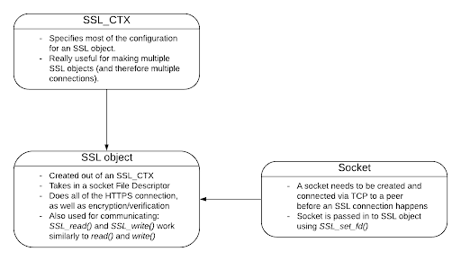
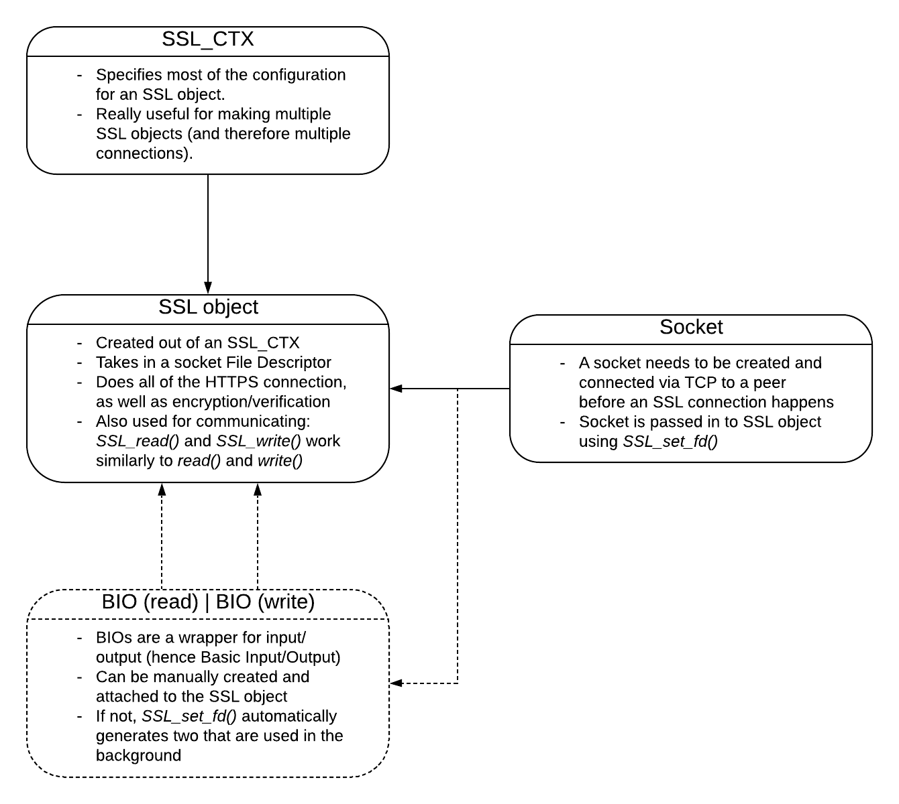

# Understanding OpenSSL

## TLS Client Documentation

### Intro
OpenSSL is super confusing. Hopefully this will clear a few things up. This guide goes sequentially through the necessary steps needed and functions used to establish a fully secure SSL connection.

In OpenSSL, the most simple way to go about creating a connection requires three things: an SSL Context object, an SSL object, and an already-connected socket’s file descriptor.

#### Generally helpful pointers
* To compile, two flags are needed: `-lssl` and `-lcrypto`. So, using gcc, a simple program using OpenSSL functions would compile when using: `gcc -o my_program my_program.c -lssl -lcrypto`.

* If a function has a ‘0’ randomly in it, such as `SSL_get0_*`, it means that the pointer you receive from the function is an internal pointer and should not be freed by your program. Conversely, ‘1’ denotes that the function increments the reference count by 1 (OpenSSL maintains internal reference counts of most objects), and the object’s corresponding `*_free()` function should be called when it is no longer in use.

* Every function that has the form `SSL_*` also has the form `SSL_CTX_*`, and vice versa (with the exception of `SSL_set1_host()`, which should only realistically be set for individual connections anyways).

* Lastly, I tend to use the terminology "object" and "struct" interchangeably in this document. Objects and classes are, of course, not implemented in C, and since the structs in OpenSSL have so much functionality my mind tends to think of them more as objects.

### Part 1: Setting up SSL_CTX (SSL Context Parameters)
The SSL Context is like the list of settings that every SSL connection adheres to when created under the context. Left default, these settings are very insecure, so we have to do a few things here. An important thing to remember is that EVERYTHING in the context has to be configured before you create SSL objects from it; if configuration is done after an SSL object is created then unpredictable bugs can occur.

#### Creating a Context
* A context is most commonly passed into other functions as a pointer, so using SSL_CTX* as the type is recommended.

* To create a new context, assign the pointer to: `SSL_CTX_new(SSL_METHOD *method)`

* `SSL_METHOD` is the return value of a function that describes the acceptable protocols of TLS to use (SSLv3, TLSv1.0, TLSv1.1, etc). Use: `TLS_client_method()`. `TLS_method()` may also work, though I have not tested this. 

* NOTE: Older versions of OpenSSL (pre-1.1.0) used: `SSL_v23_method()` as standard. Do not use this.

* Error Checking: Returns NULL on failure. It is safe to pass in `TLS_client_method()` without checking its return value.

#### Set Context To Proper Cert Verification Mode
* By default, OpenSSL does the handshake and encrypts/decrypts traffic, but it does not verify the validity of certificates.

* To enable certificate verification, use: `SSL_CTX_set_verify(SSL_CTX *ctx, int mode, <function pointer>)` Note that `<function pointer>` is a callback function; it is automatically called when the verification fails (which allows for finer tuning of success/failure parameters). The default is to set it to NULL.

* The mode specifies what verification mode to use; for client this should be: `SSL_VERIFY_PEER`. 

* Error Checking: Does not return any error value.

#### (Optional) Setting Verification Callback
* The previous function, `SSL_CTX_set_verify()`, optionally allowed for a callback function to be set. If set, this function is called [when each certificate in the certificate chain is verified](https://www.openssl.org/docs/man1.1.0/man3/SSL_verify_cb.html), whether they pass or fail.

* The proper format of such a function should be: `int cb_function_name(int status, X509_STORE_CTX *store)` Note that status will be passed in as 0 if an error has occurred in certificate validation, and 1 if not. Also, store contains the certificate chain so that we can access it to determine the nature of errors.

* The callback is called after the verification procedure, so any errors in a particular certificate can be determined using: `X509_STORE_get_error(X509_STORE_CTX *store)` This returns an integer error code, with 0 as no error. To get a string, use: `X509_verify_cert_error_string(int err)`

* Memory: The above string does not need to be freed, and is constant.

* To get further data on which certificate failed, use: `X509_STORE_CTX_get_current_cert(X509_STORE_CTX *store)` This returns an X509 certificate pointer. In addition, to get the certificate’s depth (as an integer value), use: `X509_STORE_CTX_get_error_depth(X509_STORE_CTX *store)`

* The X509 pointer can then be used with: `X509_get_issuer_name(X509 *cert)` and `X509_get_subject_name(X509 *cert)` With these functions, issuer_name will give you information on whatever entity signed the current certificate being validated, while subject_name returns information on who the certificate is registered to. Note these both return X509_NAME pointers; to convert to strings use: `X509_NAME_oneline(X509_NAME *name, char *buf, int buf_len)` The output will be written to `buf` and will not exceed `buf_len`.

* Going back to the callback function itself, the return value of the function should be 1 to continue verification or 0 to fail the verification. Note that returning 1 in this function overrides any certificate errors for the certificate that triggered the callback, so be wary of this.

* SSL checks the certificates from highest depth value (the Certificate Authority’s self-signed certificate) down to the lowest depth value (the certificate of the website you want to connect to), presumably recursively.

* Note that this callback function is not meant to replace all verification; if one wanted that functionality they would need to call: `SSL_CTX_set_cert_verify_callback(SSL_CTX *ctx, <function ptr>)`.

#### Set Certificate Authority Locations
* Before you can verify a connection, you have to set the location of accepted Certificate Authority certificates (CAs). These are stored on the computer; usually for Linux systems this is at: `/etc/ssl/certs`

* To load these certificates, use: `SSL_CTX_load_verify_locations(CTX *ctx, char *file, char *path)` Either `file` or `path` can be NULL, but not both. `file` specifies the path to a particular CA file (in .pem format); `path` is the path to a directory of CAs.

* Error Checking: returns 1 on success and 0 on failure (not reliably).

* Another function you may see is: `SSL_CTX_set_default_verify_paths(SSL_CTX *ctx)` This, however, does nothing unless certain environment variables are set. It should not be used.

#### Setting Minimum Allowed Protocol Version
* At this point, any version of TLS is accepted by your program (including SSLv3). This is insecure.

* To address this, use: `SSL_CTX_set_min_proto_version()` It has one argument, which can be: `TLS1_VERSION`, `TLS1_1_VERSION`, `TLS1_2_VERSION`, OR `TLS1_3_VERSION`

* We don’t use it, but you can also set a maximum allowed protocol version: `SSL_CTX_set_max_proto_version()`

* Error Checking: Returns 1 on success, 0 on failure.

* Versions of OpenSSL prior to 1.1.0 used: `SSL_CTX_set_options(SSL_OP_NO_SSLv3 | … )` This is deprecated now, and caused bugs when one failed to list all consecutive previous versions to the minimum version desired.

#### Set Acceptable Certificate Verification Depth (Indirectly Related to Security)
* Some certificates are linked to others in a way that they eventually reach the Certificate Authority certificate after a few chains.

* To set the maximum number of certificates that can be traversed before certification fails, use: `SSL_CTX_set_verify_depth(SSL_CTX* ctx, int num_certs)`

* Note: If you want to allow for unlimited certificates to be traversed, pass in 0 for `num_certs`

* Note: You can do this for individual SSL objects as well using: `SSL_set_verify_depth(SSL* ssl, int num_certs)`. The default verification depth is 100.

#### Set Session Timeout (Indirectly Related to Security)
* When sessions are created, they are assigned a length of time for which they are valid. To manually set this time, use: `SSL_CTX_set_timeout(SSL_CTX *ctx, long t)` Time in seconds should be passed in to `t`. 

* To get a good understanding of how long a session should realistically be valid for, you could check the default time (or the currently set timeout time if you have already set it) using: `SSL_CTX_get_timeout(SSL_CTX *ctx)`

* Error Checking: `SSL_CTX_set_timeout()` returns the previously set time; `SSL_CTX_get_timeout()` returns the currently set time. Neither have errors returned.

#### Optional: Set Security Level (The Easy Way to Set Ciphers)
* Note: I need to look into this function a bit more to determine its viability. It is available as of OpenSSL 1.1.0.

* To set a standard security level, use: `SSL_CTX_set_security_level(int level)` It has one integer parameter which defaults to 1 when not set.
    * Level 0: No restrictions whatsoever
    * Level 1: 80 bit security, MD5 and SSLv2 prohibited
    * Level 2: 112 bits, RC4 and SSLv3 prohibited; compression disabled
    * Level 3: 128 bits (such as SHA-256), forward security mandatory, only TLS 1.1+; session tickets also disabled
    * Level 4: 192 bits security, SHA1 prohibited, only TLS 1.2+
    * Level 5: 256 bits security (SHA-512)

* Note that the vast majority of websites do not support more than 128 bits of security (Level 3). 

#### Set Allowed Ciphers/Ciphersuites (The Hard, More Thorough Way)
* For the TLS 1.3 protocol we use the function: `SSL_CTX_set_ciphersuites(SSL_CTX *ctx, char *str)` Where the string contains some combination of the five accepted ciphers. The accepted ciphers are:
    * TLS_AES_128_GCM_SHA256
    * TLS_AES_256_GCM_SHA384
    * TLS_CHACHA20_POLY1305_SHA256
    * TLS_AES_128_CCM_SHA256
    * TLS_AES_128_CCM_8_SHA256
    * Note that the ciphers should be placed in the order of preference from first to last, using a colon (‘:’) to separate the cipher names.

* For TLS 1.2 and lower, use: `SSL_CTX_set_cipher_list(SSL_CTX *ctx, char *str)` This function receives a string of a different form to the other function. These strings aren’t very intuitive; they have the same colon spacing as the function above, but the similarities end there. To learn more, go [here](https://www.openssl.org/docs/man1.1.1/man1/ciphers.html)

* [Another website](https://github.com/ssllabs/research/wiki/SSL-and-TLS-Deployment-Best-Practices) addresses security, and [Mozilla has their own list](https://wiki.mozilla.org/Security/Server_Side_TLS#Recommended_Ciphersuite) of recommended safe ciphers.

* Error Checking: Both of these functions will return 1 if any cipher could be selected, and 0 otherwise. Always check to make sure 0 wasn’t returned.

#### Disabling TLS Compression
* The CRIME attack exploits TLS compression to compromise a connection. While most servers have it disabled by default and it is considered deprecated, it is still important to explicitly disable it.

* To disallow TLS compression, use: `SSL_CTX_set_options(SSL_CTX *ctx, long options_flags)`. Pass in the following flag, bitwise ORed with any other flags: `SSL_OP_NO_COMPRESSION`

#### Disable Session Tickets
* This involves a compromise that affects [every version of TLS up to 1.2!](https://blog.filippo.io/we-need-to-talk-about-session-tickets/) TLS 1.3 fixes the Session Ticket issue, but as I have found no feasible way to enable/disable session tickets based on what SSL version is decided on in the handshake, good practice is to just disable it overall.

* To disable session tickets, use: `SSL_CTX_set_options(SSL_CTX *ctx, long options_flags)` Pass in the following flag, ORed with any other flags: `SSL_OP_NO_TICKET`

* So, for instance, to disable both TLS Comp. and Session Tickets, use: `SSL_CTX_set_options(ctx, SSL_OP_NO_COMPRESSION | SSL_OP_NO_TICKET)`

* Error Checking: Doesn’t throw any errors.

#### Enable OCSP Stapling (Initial Setup)
* [OCSP Stapling](https://en.wikipedia.org/wiki/OCSP_stapling) is one of three methods available to ensure that a certificate has not been revoked. While it is not universally applied (I mean, what is? People STILL use SSLv3 and MD4…), it is considered to be the most secure and most private of the avenues available.

* OCSP Stapling is implemented in OpenSSL, though not nearly as easily as some of the other features. It has VERY poor documentation (even by OpenSSL’s standards).

* To first enable OCSP Stapling in a context, use: `SSL_CTX_set_tlsext_status_type(SSL_CTX *ctx, int type)` For the type argument, pass in: `TLSEXT_STATUSTYPE_ocsp` Now for any SSL object created from ctx, this will have it send a `status_request` extension during the handshake (thereby asking the server for a stapled OCSP cert).

* Error Checking: Returns -1 if not set `TLSEXT_STATUSTYPE_ocsp` if set.

#### Set an OCSP Callback
* Once Stapling has been enabled, a callback function will be automatically called during verification so that we can determine if the response was acceptable. To set this callback function, use: `SSL_CTX_set_tlsext_status_cb(SSL_CTX *ctx, int (cb)(SSL *ssl, void *arg))`. The callback function cb passed through this function is used to determine the validity of a stapled OCSP response.

* Error Checking: Returns 0 for error, 1 for success.

* If anything is needed within the context, it can be passed in as a pointer to any object by calling: `SSL_CTX_set_tlsext_status_arg(SSL_CTX *ctx, void **arg)` In this case `arg` is a reference to any sort of object you would want to pass through; in order to check the validity of certificates sent through OCSP stapling, we will need to have access to our SSL_CTX object, so pass it in as the second argument (in addition to the first).

* A later section will explain how to implement this callback function.

* Error Checking: Also returns 0 on error, 1 on success.

### Part 2: Setting up a Specific SSL Object (and BIO Object)
An SSL object takes all of the preset parameters of an SSL_CTX and is used for a single HTTPS connection.

#### Clearing and Reusing an SSL object
* To clear and reuse an SSL object, call: `SSL_clear(SSL *ssl)`. This function should ONLY be used if you are attempting to initiate a new connection with the same server multiple times. Using this may also fail if a server changes its settings between connections.

* Error Checking: This function returns 1 if successful, or 0 if an error was triggered.

#### BIOs
* When you first look into BIO objects, they can be really confusing. It’s because they are, and documentation on them are really poor. Basically, every time you create a specific SSL context and set it up, you can either assign a BIO object you have created or else let OpenSSL do it by itself.

* If you opt to make a BIO object, you have to use: `BIO_new_socket(int socket_fd, int close_flag)`
The downside is that you have to keep track of a BIO pointer with this, and you have to make a file descriptor either way. As we will see soon, the alternative is: `int SSL_set_fd(SSL *ssl, int fd)`

* If anything important comes up about BIOs, I will update this section accordingly.

#### Creating an SSL Object With Context
* To create a new SSL object, use: `SSL_new(SSL_CTX *ctx)` This creates an SSL object that has the attributes of context `ctx`.

* Error Checking: `SSL_new` returns NULL when an error has occurred.

#### Set SNI Hostname
* Some servers host several websites on the same IP, which means they need to be able to potentially use different certificates for the handshake depending on which website you want to connect to. TLS accommodates this through the SNI (Server Name Indication) sub-protocol.

* OpenSSL has a function to set the hostname that the handshake will use for SNI. If you fail to use this, your client will only be able to connect to some websites (for instance, badssl.com fails but instagram.com connects).

* To set the hostname, use: `SSL_set_tlsext_host_name(SSL *ssl, char *hostname)`. NOTE: This will not check to make sure that the certificate sent to you has the same domain name as the one you requested.

* Error Checking: Returns 1 on success, 0 on error.

#### Set the SSL Instance To Test the Certificate Domain Name
* As of OpenSSL 1.1.0, there is built-in support for verifying that the certificate’s name is the same as the domain you are trying to access.

* To do this, use: `SSL_set1_host(SSL *ssl, char *hostname)` For example, you could pass in the string, “badssl.com” for hostname.

* Now OpenSSL will automatically check the domain name during the handshake. If the domain doesn’t match, it will result in an error: `X509_V_ERR_HOSTNAME_MISMATCH`

* Error Checking: returns 1 for success, 0 for error.

#### Creating a File Descriptor
* This isn’t specific to OpenSSL, but I thought it would be useful to add just for the sake of not having to look it up in case you forget the c socket method.

* In simpler days, creating a file descriptor to a socket was done only using: `int socket(int domain, int type, int protocol)`. Now, however, we need to do more than this (partially because there are both IPv4 and IPv6 internet addresses, among other things).

* To get a linked list of potential domains, types and protocols, use: `int getaddrinfo(char *host, char *service, struct addrinfo *hints, struct addrinfo **result)` With the proper inputs, result will yield a list of structs with all the info needed to both create a socket (by using `socket()`) and connect to it (by using `connect()`).

* Error Checking: `socket()` will return -1 and set errno in the event of an error. On the other hand, `getaddrinfo()` will return 0 on success and a non-zero error code on failure.

#### Temporarily Disable Nagle's Algorithm (Optional)
* Nagle’s Algorithm is implemented by default in TCP connections; in an oversimplified way, it makes packets more efficient by holding off on sending them until they are full. However, due to the fact that TLS 1.3 has only one server response in the official handshake, this can sometimes cause the connection to hang for up to a few seconds before beginning to transmit/receive packets.

* For this reason, it is sometimes considered good practice to disable Nagle’s algorithm during the TLS handshake.

* To do this, use: `setsockopt(int fd, int lvl, int optname, void *optval, socklen_t *oplen)` Note that `fd` is the socket file descriptor you have successfully connected using; `lvl` should be set to `IPPROTO_TCP`; optname should be set to `TCP_NODELAY`; `optval` should be the addres of an int with value 1, cast to a char pointer; and oplen should be set to sizeof(int). The last two are mostly legacy use, from what I can tell. To demonstrate more clearly, use: `int sockopt_flag = 1; setsockopt(clientfd, IPPROTO_TCP, TCP_NODELAY, (char *)&sockopt_flag, sizeof(int));`

* Presumably, you can re-enable Nagle’s Algorithm afterwards by using the same function, but with `~TCP_NODELAY` instead. I have not tested this though, so check before using.

#### Attach the File Descriptor or BIO to the SSL Object
* It is good practice to attach the File Descriptor to the SSL object and call `SSL_connect()` as soon as is reasonable after creating the file descriptor, since the connection may time out on the server’s side things are held up for too long after the socket’s `connect()` call.

* To attach the SSL object to I/O, use: `int SSL_set_fd(SSL *ssl, int fd)` OR `int SSL_set_bio(SSL *ssl, BIO *rbio, BIO *wbio)`

* NOTE: using the first function with a file descriptor still leads to the automatic generation of a BIO object for the socket; rbio and wbio can be the same BIO object, as they are for reading and writing, respectively.

* Error Checking: `SSL_set_fd()` returns 1 on success, 0 on error. `SSL_set_bio` cannot fail.

### Part 3: Connection, Authentication, and Certificate Revocation
This part covers everything that involves the actual handshake, exchanging of certificates, validation of those certificates, and whatever else may be needed to finish an SSL connection.

#### Initiate TLS Handshake
* To perform a handshake with a server, use: `SSL_connect(SSL* ssl)`

* `BIO_do_connect()` might work as well if using BIOs; there is no guarantee.

* If the BIO is set to be blocking, then `SSL_connect()` will return once the handshake is finished (or if an error has occurred).

* Error Checking: returns 1 on success; 0 for recoverable error; < 0 for unrecoverable error.

* There are an alternate two functions that could be used in place of this one; they are actually simply called by `SSL_connect()` in the OpenSSL source code. The first is `SSL_set_connect_state(SSL *ssl)`. This sets an SSL object to be treated like a client when a handshake is initiated. To treat the object like a server, one would call `SSL_set_accept_state(SSL *ssl)` Once this is set, the following function can be called `SSL_do_handshake(SSL *ssl)` This is the function that actually initiates a handshake as a client, or receives and handles a handshake as a server.

* Error Reporting: Returns 1 on success, 0 if shut down, < 0 on fatal error.

#### Test the Certificate Received From the Server on OpenSSL’s Tests
* First, get the peer certificate (stored as an X509 pointer) by using `X509* SSL_get_peer_certificate(SSL* ssl)`

* If the resulting cert pointer is NULL, then you could return the error: `X509_V_ERR_APPLICATION_VERIFICATION` This is a generic unused error, and it would work well for indicating that no certificate has been passed in the handshake.

* Memory: The X509 struct must be freed after use by using `X509_free()`.

* To determine if the certificate passes OpenSSL cert verification tests, use: `X509_V_OK == SSL_get_verify_result(SSL* ssl)`

* NOTE: OpenSSL doesn’t completely cover all of the possibilities when verifying a cert; by default it only verifies the CA, checks the certificate chain for valid signatures, and rejects any invalid ciphersuites.

#### Certificate Revocation - Motivation
* From time to time, server certificates and private keys are compromised by those with malicious intent. In response to this, Certificate Authorities designate those certificates as being ‘revoked’, meaning that the certificate may still be within its signed validity period and not be valid.

* To distribute knowledge of such revoked certificates, CA’s use four strategies:
    1. Certificate Revocation Lists (CRLs)
    2. Online Certificate Status Protocol (OCSP) Checking
    3. OCSP Stapling (Attaching an OCSP response to a server’s cert)
    4. Certificate Transparency

* In terms of security and privacy, OCSP Stapling is the most effective of the three methods. OCSP Stapling involves the server periodically polling the OCSP for a signed OCSP Response. The server then ‘staples’ (or appends) that request to the certificate it sends to clients. 

* This way, the server sends the OCSP Response in almost the same amount of time that it would have taken for it to send just the certificate (unlike CRL or OCSP Checking, which require an additional connection/download).

* OCSP Requests are still quicker than downloading a CRL file, though they present a downside--the privacy of what sites the client is connecting to is compromised to the OCSP responder.

* CRL’s were the original solution to cert revocation. They are pretty much ubiquitous, though they require an additional TCP connection, downloading a CRL file and then checking through that CRL file to determine validity.

* My preferred order would be: 1. Request an OCSP stapled response, 2. Initiate a TCP connection with the CRL distributer as soon as possible in a non-blocking connection and then check it if the stapled response fails, and 3. Do an OpenSSL built-in OCSP Request and check the response (unless some privacy flag is set in the config file).

#### Creating The OCSP Callback Function
* From the functions we called in Part 1 (under "Enable OCSP Stapling and Set an OCSP Callback"), almost everything is already set up for OCSP stapling. However, we need to craft our own callback function to check the stapled OCSP response and handle verification.

* The callback function itself must be of the form: `int callback_name(SSL *ssl, void *arg)` This is a function you construct and implement yourself, and then pass to `SSL_CTX_set_tlsext_status_cb` as the second parameter (see Part 1).

* This function should return -1 for errors, 0 for invalid response (this results in handshake failure and termination), or positive if valid.

#### Check For OCSP Stapled Response
* To clarify, all code implemented here should be written within the callback function mentioned above. In our case, we will operate under the assumption that our context ctx has been passed in for `arg` (the importance of this will be noted later). Note that it should be cast into an `SSL_CTX` pointer.

* To obtain the OCSP response sent by the server, use: `SSL_get_tlsext_status_ocsp_resp(SSL *ssl, char **resp)` The value of `*resp` will be updated to point to the response data; it should be passed in as the address of a char pointer (such as `&char_ptr`).

* Error Checking: Returns the length of the response, or -1 and `resp` will be NULL if no response was sent.

* Memory: The above returns an internal pointer that should not be freed.

#### Parse Given OCSP Response
* Once the data is stored in a char pointer, use the following to convert it: `d2i_OCSP_RESPONSE(NULL, const unsigned char **rin, long len)` It returns an `OCSP_RESPONSE` pointer. Note that resp should be passed in as the parameter of `rin`, and the first parameter should always be passed in as NULL--it is a legacy feature for backwards compatibility only.

* Error Checking: Returns NULL on failure, pointer to response otherwise.

* Memory: The struct should be freed using `OCSP_RESPONSE_free()`.

* From here, we check to ensure the OCSP response is correct by using: `OCSP_response_status(OCSP_RESPONSE *resp)` This returns an error code; on success the following error code is returned (This is a defined constant for it): `OCSP_RESPONSE_STATUS_SUCCESSFUL`

* If no errors are present, then further convert the response by using: `OCSP_response_get1_basic(OCSP_RESPONSE *resp)`

* Error Checking: Returns NULL in an error, OCSP_RESPONSE struct otherwise.

* Memory: The struct should be freed using `OCSP_BASICRESP_free()`.

#### Verify the Validity of an OCSP Response
* In order to check the validity of an OCSP response, OpenSSL needs to have the full certificate chain given by the server, as well as the `X509_STORE`, which contains data on the loaded Certificate Authorities.

* To get a full certificate chain, use: `SSL_get_peer_cert_chain(const SSL *ssl)`.This returns a `STACK_OF(X509)` pointer.

* Error Checking: Returns NULL if no certificate chain was sent by the server or if it is no longer available (the latter should not happen).

* To get an X509_STORE pointer, use: `SSL_CTX_get_cert_store(ctx)`

* Error Checking: This function does not return errors.

* Memory: This returns an internal pointer that should not be freed.

* Once these are obtained, use: `OCSP_basic_verify(OCSP_BASICRESP *bs, STACK_OF(X509) *certs, X509_STORE *store, unsigned long flags).` This function does most of the difficult bits of verification. When no flags are set, this function will default to the most thorough OCSP verification.

* Visual inspection of code [here](https://github.com/openssl/openssl/blob/OpenSSL_1_1_1-stable/crypto/ocsp/ocsp_vfy.c) suggests that this function is sufficiently thorough at name checking, CA matching and other important aspects of determining the validity of a response.

* Error Checking: Returns 1 on success, 0 on failure, < 0 on fatal error.

#### (Optional) Manual Inspection of OCSP Certs
* Printing out the OCSP response can be helpful in debugging. Use: `OCSP_response_print(BIO *bp, OCSP_RESPONSE *o, long flags)` Set flags to 0, and create a BIO object that points to `stderr` or `stdout`.

* This function is NOT documented at all in OpenSSL’s man pages, even though it works reliably and would be incredibly useful to know about… its source can be found [here](https://github.com/openssl/openssl/blob/e7fb44e7c3f7a37ff83a6b69ba51a738e549bf5c/crypto/ocsp/ocsp_prn.c).

* To create a BIO object that will work for such a function, use: `BIO *bio = BIO_new(BIO_s_fd()); BIO_set_fd(bio, 2, BIO_NOCLOSE); /* 2=file descriptor for stderr, NOCLOSE to not close fd after use */`. To avoid memory leaks, once finished with the object use: `BIO_free_all(bio);`

* An OCSP Response may have several responses chained together. To check this, use: `OCSP_resp_count(OCSP_BASICRESP *basic_resp)` This returns the number responses (which should correspond to the number of certificates you are trying to verify).

#### OCSP/CRL Server URL Retrieval (NOTE: Incomplete)
* If OCSP Stapling is not implemented by the server (an unfortunately common occurrence), one needs to establish a separate TCP connection with either an OCSP Responder or a CRL Distributor for the Certificate Authority that has signed the certificate you are checking.

* Thankfully, we don’t need to look these up or have them all stored, they are (almost?) always given to us as an information field extension on the X509 certificates passed to us by the server.

* These can be incredibly frustrating and difficult to parse from an X509 certificate if one does not know beforehand the functions they must use from OpenSSL; this section was easily the most difficult and time-consuming topic of OpenSSL I looked into.

#### Getting a Single Certificate from Stack:
* First, we need to have the X509 Certificates sent by the server. To get the stack, use: `STACK_OF(X509) *SSL_get_peer_cert_chain(const SSL *ssl)` or `STACK_OF(X509) *SSL_get0_verified_chain(const SSL *ssl)` Note that `SSL_get0_verified_chain()` can only be used if verification is already complete, such as if `SSL_get_verify_result()` returns `X509_V_OK`.

* Error Checking: Returns Null if the Certificates are not available.

* To determine the number of certs in a stack, use: `sk_X509_num(const STACK_OF(X509) *sk)`

* To get a single X509 certificate from a stack of them, use: `sk_X509_value(STACK_OF(X509) *sk, int idx)`. These functions were found [here](https://www.openssl.org/docs/man1.1.1/man3/sk_TYPE_find.html).

* By convention, the certificate at index 0 will be the company’s personal certificate; index 1 will be the certificate that signed that one, and so on until the top certificate which is the self-signed CA certificate.

* TODO: I’m not sure which one of the certificates we would want to use for the extensions; I would think that checking the first CA certificate would be safest, as it is the one that must be given to the server by the CA, so its Authority Information Access extension could not be modified. Look into this.

#### Retrieve Authority Information Access From Certificate
* Once we have the single X509 Certificate we want to retrieve Authority Information Access from, we need to parse it out of the cert. Use: `X509_get_ext_d2i(const X509 *x, int nid, int *crit, int *idx)`. In this case, we want nid to be: `NID_info_access`. Information on what `crit` returns is well-documented [here](https://www.openssl.org/docs/man1.1.1/man3/X509V3_EXT_d2i.html)--it provides helpful information as to whether the certificate has multiple extensions of type `nid` or whether the extension is defined as a critical extension. If `idx` is set to NULL, only one of the extension type `nid` is permitted; otherwise the function will (maybe?) return NULL. On the other hand, if `idx` is not null it should point to an index number; the function will only look at extensions after that index. If an extension is found, `idx` will be updated to the location of the current index. In general, use `*idx = -1`.

* Error Checking: Returns NULL on failure; otherwise, returns a void pointer referencing a struct that is specific to the extension type you are requesting. In our case, an `AUTHORITY_INFO_ACCESS` pointer is returned.

* One could also use `NID_crl_distribution_points` to obtain a CRL Distributor’s URL. TODO: Research how to do this.

#### Parse Authority Information Access
* The `AUTHORITY_INFO_ACCESS` type is actually a typedef for: `STACK_OF(ACCESS_DESCRIPTION)`

* Once again, we use the functions: `sk_ACCESS_DESCRIPTION_num(const STACK_OF(X509) *sk)` and `sk_ACCESS_DESCRIPTION_value(STACK_OF(X509) *sk, int idx)`. These act identically to `sk_X509_num()` and `sk_X509_value()`; the only difference is that they operate on a different struct type. Learn more [here](https://www.openssl.org/docs/man1.1.1/man3/sk_TYPE_num.html).

* From here, we can iterate through every `ACCESS_DESCRIPTION` struct and access their parameters. Some certificates will have OCSP Responders listed first and CRL Distributors listed second; others will have it the other way around. We just need to check.

* The `ACCESS_DESCRIPTION` struct has two members: `ASN1_OBJECT *method` and `GENERAL_NAME *location`. The method field holds information on whether `location` holds an OCSP address or a CRL address. To parse it, use: `OBJ_obj2txt(char *buf, int buf_len, const ASN1_OBJECT *a, int no_name)` One should allocate `buf` as a char array of around 80 characters beforehand; it is where the name of the type will be passed in, along with `buf_len` as the length of that buffer to prevent an overflow. `Method` should be passed in to `a`, and `no_name` should be set to 0 to return a character representation (as opposed to the numeric representation option, 1).

* Error Checking: Returns the number of characters written to `buf`, 0 if no information was able to be retrieved, and -1 for error.

#### Parse Authority Information Access (Part 2: Retrieving the Address) 
* With the information now stored in `buf`, you should be able to differentiate between whether the field is the OCSP address or the CRL address (by checking against a constant string “OCSP Responder:” or “CA Issuers:”). TODO: see if there is a better way to do this.

* The `GENERAL_NAME` is a struct containing two elements: an integer identifier and a pointer to the URL encoded in ASN1 format. We need to check to make sure the integer `(GENERAL_NAME->type)` matches: `GEN_URI`. This is a defined constant that indicates the pointer, `GENERAL_NAME->d` is of the correct type (since it is a union). To understand better, look at line 129 of [here](https://github.com/openssl/openssl/blob/54a0d4ceb28d53f5b00a27fc5ca8ff8f0ddf9036/include/openssl/x509v3.h).

* To convert the ASN1-encoded pointer to a C string, use: `ASN1_STRING_to_UTF8(    unsigned char **out, const ASN1_STRING *in)`. The encoded pointer should be passed in in the following way: `GENERAL_NAME->d.uniformResourceIdentifier`. The char pointer `out` should be an address to an unallocated pointer; the function automatically allocates all that is needed. Once finished and ready to free the memory, one should use: `OPENSSL_free(char *buf)`

* Error Checking: `ASN1_STRING_to_UTF8` returns either the length of `out` or a negative error code.

* Using all of these functions to parse the extension ensures that any chance of malicious code being injected into these extensions is virtually eliminated, as the functions will return errors unless the extension is very strictly formatted.

#### OCSP Checking
* Now that we have the OCSP responder’s URL, we can use a few built-in OpenSSL functions to get an OCSP response.

#### CRL Checking
* From here, we can split the URL into the domain name (regex would be *.*/, but minus the slash) and the request path (*after-domain*.crl). This string splitting is left as an exercise to the reader. Mwahahahaha.

* We can then use regular sockets to connect to the CRL domain, and then use a simple http request to get the .crl file. Once again, this is (for now) left as an exercise for the reader :P.

### Part 4: Post-Connection Communication and Cleanup
After the end of a connection, it is necessary to free resources to prevent memory leaks. This covers what resources need freeing after an individual connection, as well as at the very end of the program.

#### Communication Using Read and Write Functions
* To read from an SSL object, use: `SSL_read_ex(SSL *ssl, void *buf, size_t num, size_t *readbytes)` OR `SSL_read(SSL *ssl, void *buf, int num)`. Note that there are also associated peek functions to read without erasing: `SSL_peek_ex(SSL *ssl, void *buf, size_t num, size_t *readbytes)` OR `SSL_peek(SSL *ssl, void *buf, int num)`, Where `*ssl` is the SSL context, `*buf` is a buffer, `num` is the number of bytes to be read, and `*readbytes` is the number of bytes that are actually read into `*buf`.

* Writing to an SSL object is very similar. Use: `SSL_write_ex(SSL *s, const void *buf, size_t num, size_t *written)` OR `SSL_write(SSL *ssl, const void *buf, int num)`. Inputs are pretty much the same here as in the read and peek functions.

* Error Checking: the functions ending in ‘_ex’ return 1 on success and 0 on failure. The other functions return > 0 on success (indicating the number of bits actually read) and <= 0 on failure. Sometimes the failure is simply that it read any bytes in yet, so you should check the error to see if it can retry.

#### Shutdown the SSL Connection
* To close an SSL connection, call: `SSL_shutdown(SSL *ssl)`. This sends a notification to the peer that the connection is being closed.

* This function should not be called if a fatal error has occurred at any point in the SSL connection.

* Error Checking: returns 1 on success, 0 if still waiting for the server to respond, and < 0 if there is an error.

* There can be some implications to do with session tickets; see [here](https://www.openssl.org/docs/man1.1.1/man3/SSL_shutdown.html).

#### Free getaddrinfo() If Used
* These next ones are pretty self-explanatory. Use: `freeaddrinfo(struct addrinfo *result)`

#### Free the X509 Certificate
* `X509_free(X509 *cert)`

#### Free the SSL Object
* `SSL_free(SSL *ssl)`

#### Free the SSL Context
* `SSL_CTX_free(SSL_CTX *ctx)`

#### General Free Functions
* As you can now probably see, OpenSSL implements `TYPE_free()` functions that work for almost any struct. These functions should be used in place of `free()`, as OpenSSL implements reference counts that will not work as intended unless their freeing functions are used.

### Part 5: Error Checking
OpenSSL has a pretty unique way of reporting errors. It almost always follows the standard of returning NULL (in the case of a pointer return type) or a non-positive integer (in the case of an integer return type) when an error occurs within a function, but the actual error code is rarely ever returned by the function. Instead, OpenSSL has a queue that holds all of the errors currently thrown by any of its internal workings, as well as a few functions that allow you to access and manipulate this queue.

You may notice that the error codes return longs (64 bits on most operating systems). This is a bit quirky, but I have read that the errors themselves are meant to fit within 32 bits. This may have been to ensure compatibility with 16-bit machines.

There are special error codes thrown during the handshake process of a connection that are not reported in the queue, other than error 0x1416F086: certificate verify failed.

#### Check For a Connection Error
* As mentioned above, if a peer fails to validate in some way during the handshake or some fatal error occurs, the error 0x1416f086 is pushed to the error queue.

* To get more specific error codes for this, use: `SSL_get_verify_result(SSL *ssl)`. This will return a long representing the particular error code. These are all defined; for instance, the following defined constant represents an error free connection: `X509_V_OK`

* To see all possible error codes, go [here](https://www.openssl.org/docs/man1.1.1/man1/verify.html).

* These could be easily checked for using switch cases.

#### Check For a Thrown Error
* To see if an error has been thrown, best practice is to make sure your code checks each function that could return an error type. However, there may be times when you want to determine the type of error that has been thrown. To do this, use: `unsigned long ERR_peek_error()`. If it returns 0, there are no errors currently reported; otherwise, it will return the error code of the last reported error. 

* Note: If there is an error, this function will simply return its value rather than popping it off of the OpenSSL error queue.

#### Handle a Thrown Error
* To clear the first thrown error from the error queue, use: `unsigned long ERR_get_error()`. This will return the error code, or 0 if the queue is empty.

#### Check the Most Recently Thrown Error
* To get the error that was thrown last, use: `unsigned long ERR_peek_last_error()`. Again, this will return the error code, or 0 if no error is in the queue.

* Note: Once again, this will not pop the error out of the queue.

#### Print All Errors
* This function is very much for the convenience of debugging. Use: `ERR_print_errors_fp(FILE *fp)`. Using `stdout` or `stderr` for the FILE pointer will print the errors to the terminal screen.

#### Clear The Error Queue
* To clear the error queue completely, use: `ERR_clear_error()`. A useful thing to know is that this function preserves the state of errno. This comes in handy when reporting errors and cleaning up after them.

* Error Checking: None.

### Appendix A: Random Stuff to Finish
(cleared for brevity)

### Appendix B: Errors Difficult to Debug (At Least the Ones I’ve Found)

#### Connection Works But Accepts Any Connection
* It could be that you failed to call `SSL_CTX_set_verify()` with the flag `SSL_VERIFY_PEER`. If this function isn’t called, then no authentication is done and all the other functions like `SSL_connect()` act as if everything passes tests.

#### No Connection Working; Consistently Throws ‘Self-Signed Cert’ Error
* This means that your Certificate Authorities have not been loaded properly (for whatever reason)

* First, check to make sure that you’re calling: `SSL_CTX_load_verify_locations(ctx, NULL, “/path/to/certfile”)`

* Additionally, make sure that the first ‘/’ is present in your string; if not then this function will return success even though it is failing to load any CAs, since the path is faulty. This got me hung up for hours.

* If this is correct and it’s still failing, check to make sure that the path your loading actually contains the Certificate Authority certs

### Appendix C: Old Versions of OpenSSL / Extra Bits
OpenSSL improved significantly with the release of 1.1.0 and 1.1.1, so some initialization is unnecessary now:

#### Loading Libraries
* The following are required for versions before OpenSSL 1.1.0: `SSL_library_init()` and `OpenSSL_add_all_algorithms()`

* Optional libraries for reading errors: `SSL_load_error_strings()` and `ERR_load_BIO_strings()` 

#### Seeding the Random Number Generator
* This bit is actually really easy--OpenSSL seeds and re-seeds PRNG automatically, so usually you don’t have to do anything.

* NOTE: It is unsure whether or not you need to check RAND_status() before doing an SSL connection. Will research this further.

* Default RNG method is RAND_OpenSSL(). It is secure.

* You can change this if you really want with RAND_set_rand_method(). You can also find the current method with RAND_get_rand_method().

* One thing to note is that sometimes the system has not generated sufficient entropy for PRNG to properly seed. If this is the case, then RAND_bytes() and RAND_priv_bytes() will fail and return an error code (0 or -1).

* Use RAND_status() to determine if the PRNG is properly seeded (returns 1 if it is, 0 if it isn’t)

* Use RAND_poll() to generate more seed data (returns 1 if it has, 0 if not)

#### Determine the Nature of an Error
* OpenSSL’s ERR library has a set of strings associated with the error codes it throws. These can be loaded at the start of a program by calling: `ERR_load_crypto_strings()`. But note that this is unnecessary as of OpenSSL 1.1.0.

* At the end of the program, make sure to call: `ERR_free_strings()`. This ensures that no memory leaks occur. This is also unnecessary as of OpenSSL 1.1.0.

## TLS Server Documentation

## OpenSSL Error Reporting